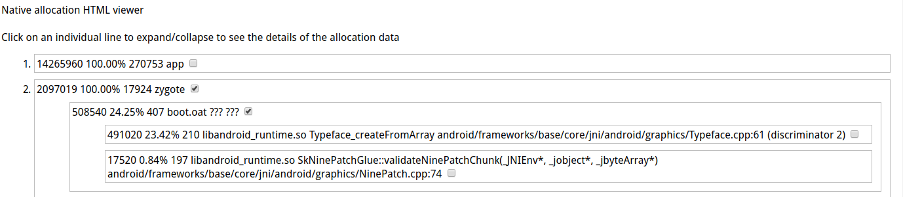

原始版本：<https://github.com/aosp-mirror/platform_development/blob/master/scripts/native_heapdump_viewer.py>

修改如下：

- 替换`objdump`为`arm-linux-androideabi-objdump`; 替换`addr2line`为`arm-linux-androideabi-addr2line`
- 使用`/usr/bin/env python2`
- 优化`html`的输出效果，让`html`更易读

